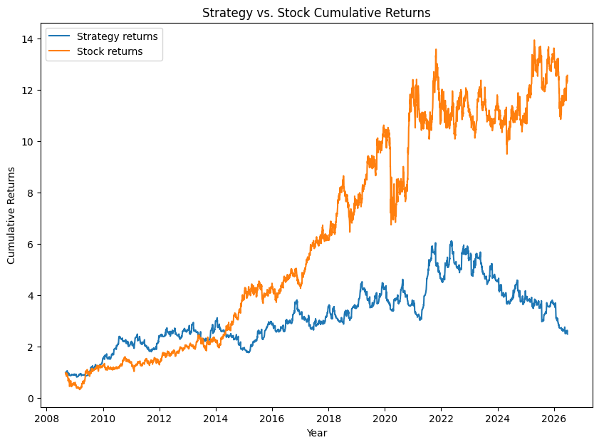
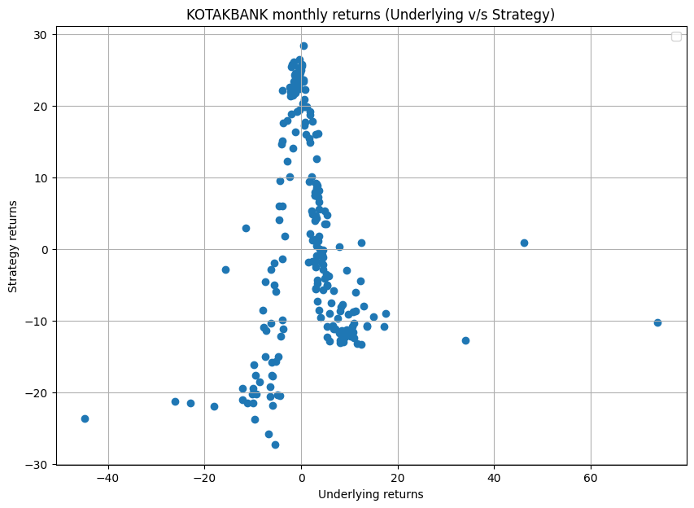
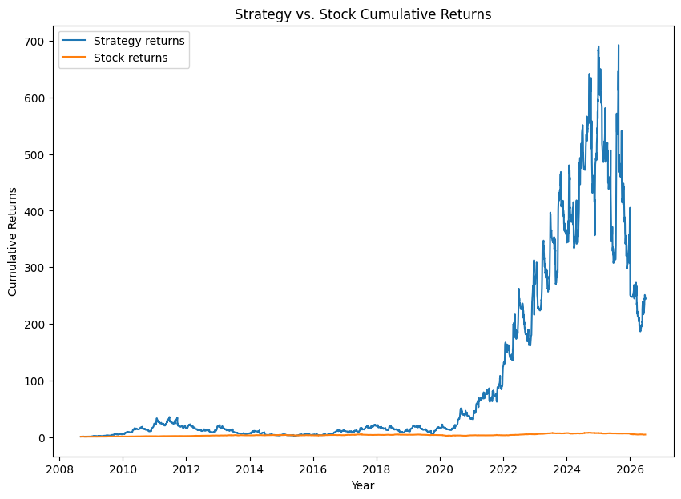
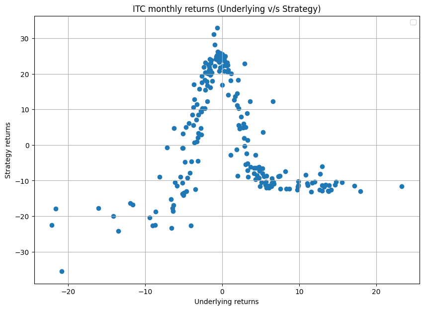

# Options Backtesting — Synthetic Black-Scholes Backtest

**Project name:** Synthetic Black-Scholes Backtest
**Strategy tested:** Short Iron Butterfly (monthly expiry, NSE single-stock options)

## Introduction

This project backtests an options-selling strategy on Indian (NSE) single-stock
options **without using any historical options data**. Since clean, long-history,
strike-level options data for Indian stocks is expensive and hard to obtain, the
options are instead **priced synthetically** using the Black-Scholes model, fed
with the underlying's price history, the prevailing repo rate (as the risk-free
rate), and rolling realized volatility.

The goal is to study the **mechanics, risk profile, and theoretical edge** of a
short iron butterfly — a premium-collecting, range-bound strategy — across roughly
18 years of price history, and to compare it against a simple buy-and-hold of the
underlying.

> This project is academically useful for demonstrating strategy mechanics and
> payoff behaviour, but it is **not** a substitute for real-market-data validation.
> See the [Limitations](#limitations) and [Precautions](#precautions) sections.

## The Strategy: Short Iron Butterfly

A short iron butterfly is a defined-risk, premium-collecting position that profits
when the underlying stays close to its entry price (low realized movement). On each
entry the strategy:

1. **Sells** an At-The-Money (ATM) call and an ATM put (the short straddle / body).
2. **Buys** an Out-of-The-Money (OTM) call and an OTM put (the long strangle / wings)
   to cap the tail risk.

The wing width is set dynamically to the **total ATM premium collected** — i.e. the
OTM strikes are placed roughly one straddle-premium away from the ATM strike. Net
premium is received up front, and the position is held for one monthly cycle.

The resulting payoff is the classic "tent" shape: maximum profit when the underlying
expires near the ATM strike, and a capped loss if it moves sharply in either
direction.

## How the Backtest Was Built

The end-to-end logic lives in [options_backtesting.ipynb](options_backtesting.ipynb).
The pipeline:

1. **Data download** — ~18 years of daily OHLC for the chosen NSE ticker are pulled
   from Yahoo Finance (`yfinance`) in 700-day chunks and de-duplicated.
2. **Risk-free rate** — yearly RBI repo rates from [repo_rate.csv](repo_rate.csv),
   sourced from the [RBI Database (DBIE)](https://data.rbi.org.in/#/dbie/searchresult),
   are merged onto the price series and forward-filled to give a daily risk-free rate.
3. **Volatility estimate** — a 45-day rolling standard deviation of daily returns is
   computed and annualized (× √252) to serve as the Black-Scholes `sigma`.
4. **Expiry calendar** — Indian monthly stock options expire on the last Tuesday of
   each month; the backtest builds this calendar and **squares off one day before
   expiry** before rolling into the next cycle.
5. **Strike selection** — the ATM strike is snapped to realistic exchange strike
   intervals via price-band rules (e.g. ₹1 / ₹2 / ₹5 / ₹10 ... steps depending on
   the underlying's price level). OTM wing strikes are derived from the collected
   premium.
6. **Pricing** — every leg (ATM call/put, OTM call/put) is priced with Black-Scholes
   at entry, daily mark-to-market, and exit.
7. **Bookkeeping** — three logs are maintained:
   - a **strategy book** (one row per round-trip trade),
   - a **tradebook** (every individual leg's open/close), and
   - a **trade log** (daily unrealized/realized P&L for the open position).
8. **Performance** — margin is assumed at **3× net premium received**; returns are
   computed against this margin. The notebook reports win ratio, average win/loss,
   expected value per trade, total and CAGR returns, and plots the strategy vs.
   buy-and-hold.

A **train/test split** is used: data up to **2022-12-31** is treated as the training
window, and **2023 onwards** is held out for out-of-sample testing.

## Results

The strategy was run on two NSE names with contrasting price behaviour —
**KOTAKBANK** (a strong long-term trender) and **ITC** (long range-bound periods).

### Sample metrics (KOTAKBANK, training window)

| Metric | Value |
| --- | --- |
| Total trades | 172 |
| Win ratio | 50.58% |
| Average win | +14.58% |
| Average loss | −10.63% |
| Expected value / trade | +2.12% |
| Strategy CAGR | 16.78% |
| Buy-and-hold CAGR | 18.44% |

### KOTAKBANK — Strategy vs. Stock (cumulative)

The strategy roughly tracks (and slightly lags) buy-and-hold on a strongly trending
stock, because large directional moves repeatedly push the underlying away from the
ATM strike — the worst case for a premium seller.



### KOTAKBANK — Monthly returns (underlying vs. strategy)

The scatter shows the tell-tale **inverted-V / tent payoff**: the best strategy
returns cluster where the underlying moved little (near 0% on the x-axis), and losses
grow as the underlying moves sharply either way.



### ITC — Strategy vs. Stock (cumulative)

On a stock that spent long stretches range-bound, the synthetic backtest shows the
strategy **massively outperforming** buy-and-hold — exactly the regime a short iron
butterfly is built for. (This also illustrates how dramatically synthetic results
can overstate an edge; see Limitations.)



### ITC — Monthly returns (underlying vs. strategy)

The same tent-shaped payoff, even more pronounced: profits peak around zero
underlying movement and decay symmetrically as the move size grows.



## Setup & How to Run

### Prerequisites

- Python 3.9+
- Jupyter Notebook / JupyterLab (or VS Code with the Jupyter extension)

### Installation

```bash
# 1. Clone the repository
git clone <repo-url>
cd options-backtesting

# 2. (Recommended) create a virtual environment
python -m venv .venv
source .venv/bin/activate        # on Windows: .venv\Scripts\activate

# 3. Install dependencies
pip install numpy pandas matplotlib scipy yfinance jupyter
```

### Running

```bash
jupyter notebook options_backtesting.ipynb
```

Then:

1. Set the ticker at the top of the notebook, e.g. `stock_name = 'KOTAKBANK'`
   (use the NSE symbol; `.NS` is appended automatically for Yahoo Finance).
2. Run all cells top to bottom. Data download requires an internet connection.
3. The notebook prints the performance metrics and renders the cumulative-returns
   and monthly-returns plots. Save them to PNG to reproduce the images above.

> **Note:** `repo_rate.csv` ships with annual repo rates. Extend it if you backtest
> periods outside its coverage so the risk-free rate forward-fills correctly.

## Observations

- The strategy performs **best on stocks with stationary / range-bound prices**
  (e.g. ITC), where the underlying repeatedly expires near the ATM strike and the
  collected premium is retained.
- On **strongly trending stocks** (e.g. KOTAKBANK), it roughly matches or slightly
  lags buy-and-hold, because sustained directional moves are the premium seller's
  worst case.
- The win ratio hovers near **50%**, but the strategy carries a **positive expected
  value** because, in this synthetic setting, average wins exceed average losses.
- The underlying-vs-strategy scatter consistently shows the **inverted-V payoff**,
  confirming the position behaves as a short-volatility / mean-reversion bet.

## Assumptions

- **Margin** is approximated as **3× the net premium received** for the option-selling
  position.
- **Black-Scholes** assumes constant volatility and log-normal returns, which rarely
  hold in reality.
- The **risk-free rate** is approximated by the RBI repo rate (fetched from the
  [RBI Database (DBIE)](https://data.rbi.org.in/#/dbie/searchresult)), sampled
  annually and forward-filled.
- **Volatility** is a 45-day rolling realized estimate, annualized — used both to
  price the options sold and to mark them daily.
- Positions are entered/rolled on a monthly cycle and squared off **one day before
  the last-Tuesday expiry**.

## Limitations

- Options are priced from **realized volatility**, whereas real market prices reflect
  **implied volatility** — which embeds a volatility risk premium and changes
  dynamically. A premium seller's real edge (or lack of it) lives almost entirely in
  the IV-vs-RV gap, which this model cannot capture.
- The model ignores the **volatility smile/skew and term structure**.
- It ignores real-world frictions: **bid-ask spreads** (often very wide in Indian
  single-stock options), **liquidity gaps**, **execution slippage**, and brokerage/
  taxes.
- The margin model (3× premium) is a rough proxy for actual SPAN + exposure margins.
- **Net effect:** the backtest will likely **overstate profitability** and will not
  reflect real-world P&L — the ITC result is a stark example of how large that
  overstatement can be.

## Precautions

This should be treated only as a **preliminary / theoretical analysis**. It is
**not** reliable enough for live-deployment decisions. Many strategies look excellent
in synthetic backtests yet fail in live trading because of the factors listed above.

When interpreting the results:

- Read the cumulative-returns charts as **relative behaviour across regimes**
  (trending vs. range-bound), not as achievable real returns.
- Treat the headline CAGR and expected value as an **upper bound** on a real-world
  outcome, before costs and the implied-vs-realized volatility gap.
- Before considering anything live, re-validate with **actual historical options
  data**, realistic transaction costs, and proper margin modelling.

## Repository Contents

| File | Description |
| --- | --- |
| [options_backtesting.ipynb](options_backtesting.ipynb) | Full backtest pipeline and analysis |
| [repo_rate.csv](repo_rate.csv) | Annual RBI repo rates (from [RBI DBIE](https://data.rbi.org.in/#/dbie/searchresult)) used as the risk-free rate |
| `KOTAK_cum_returns.png`, `KOTAK_monthly_returns.png` | KOTAKBANK result charts |
| `ITC_cum_returns.png`, `ITC_monthly_returns.png` | ITC result charts |
| [LICENSE](LICENSE) | License |
